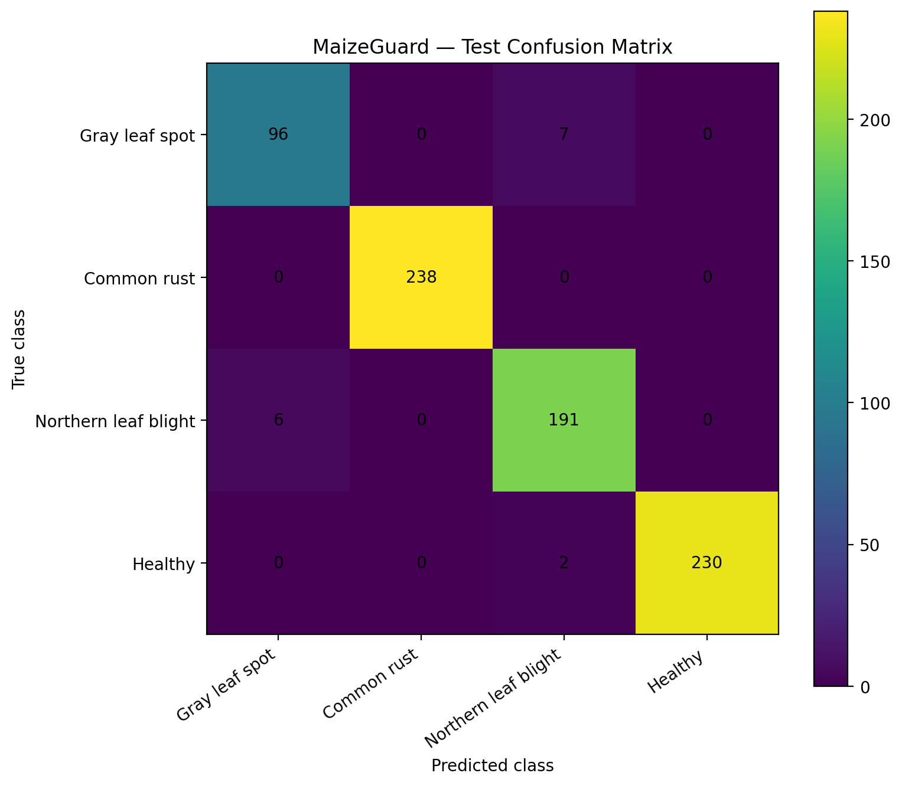
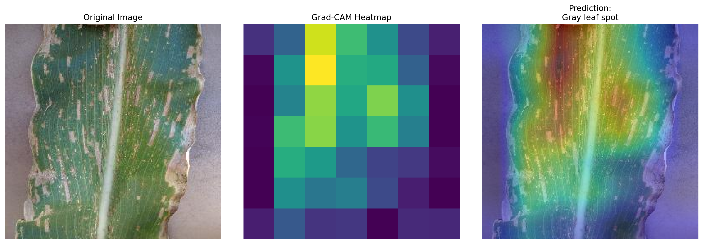

# MaizeGuard

Deep learning maize leaf disease classification system using EfficientNetB0, Grad-CAM and TensorFlow.

The model classifies maize leaves into:
- Gray leaf spot
- Common rust
- Northern leaf blight
- Healthy

## Confusion Matrix

## Model Explainability

